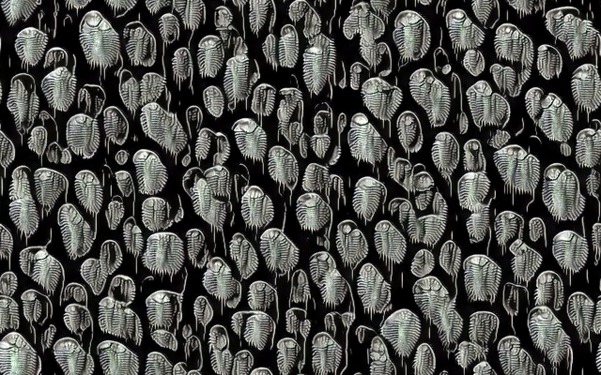

# "Neural CA Kunstformen" GitHub Collectable 💎

**Author:** Alexander Mordvintsev ([github](https://github.com/znah), [twitter](https://twitter.com/zzznah), [web](https://znah.net/))

**Medium:** Git repository

## **Original URL:** https://github.com/znah/gitart_kunstformen_ca

### What? 

This repository is a unique Collectable Digital Artwork. It can be held by the current owner,
or transferred to a new owner using GitHub “[Transfer Repository](https://docs.github.com/en/github/administering-a-repository/transferring-a-repository)” 
feature. Authenticity of the repository can be proven by following the **Original URL**.
According to the GitHub [documentation](https://docs.github.com/en/github/administering-a-repository/transferring-a-repository#whats-transferred-with-a-repository):
“All links to the previous repository location are automatically redirected to the new location.” 
Thus, the repository is considered authentic if and only if the **Original URL**, defined by its author, redirects to its current location.

### Why?

The rise of blockchain-based NFT market demonstrated that digital assets can be attractive collectable objects.
Contrary to NFTs, that only indirectly represent the collected digital object, owning a GitHub repository gives full sense of ownership,
including the responsibility to deal with issues and PR requests, or power to make it private or take it down.

Git-repository art form may contain generative artworks, the code that produced them, the history of the development of this code,
and other artifacts. This provides the collector with the intimate connection with the artwork creation process.

### What’s with the license?

The code in this repository is subject to Apache License 2.0. This means that the repository may be cloned and forked, the code may be appropriately reused.
**Still there is only one authentic collectable repository, that can be traced through the Original URL.**

### Is it possible to sell this repository?

Yes, the repository owner is free to transfer the ownership to another person or organisation for whatever reason they find appropriate.
In the case of public sale it’s recommended to handle the process through opening an issue that explains the sale conditions.
Unsolicited buy offers can also be submitted through issues.

## Artwork description
This artwork is a GitHub repository that contains a modified version of the PyTorch colab [notebook](https://colab.research.google.com/github/google-research/self-organising-systems/blob/master/notebooks/texture_nca_pytorch.ipynb)
from [Self-Organising Textures](https://distill.pub/selforg/2021/textures/) article, developed by the artist.
The code simulates and trains a Self-Organizing System of cells that builds and persists a visual pattern, trying to imitate the ‘[Aspidonia](https://commons.wikimedia.org/wiki/File:Haeckel_Aspidonia.jpg)’ drawing by Ernst Haeckel.
In addition, the repository contains artifacts produced by running the code, such as trained CA models, images and videos.

## Artist statement
Ability to build and maintain its own body is the first skill every living creature possesses.
Self-Organization is omnipresent in nature, from molecular to global scale.
This artwork invites adventurers explorers to play with self-organization,
and think about the relationship between parts and the whole,
from bits and molecules to societies and ecosystems.
